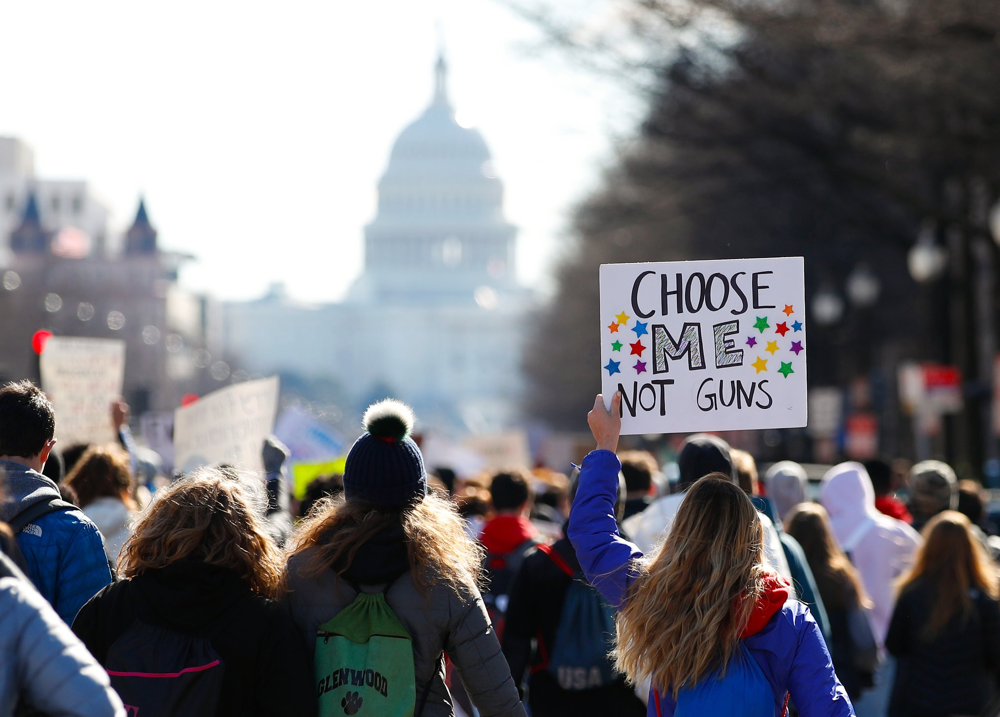

 

### **Motivation**
Gun violence is of increasing concern for the US population over the last few years, and we are interested in looking at what might be associated with increased gun violence. [MORE MOTIVATION]

 

### **Data**
***Mass shooting data*** can be accessed [here](https://www.kaggle.com/jameslko/gun-violence-data) and is from the [Gun Violence Archive](http://www.shootingtracker.com/), a "online archive of gun violence incidents collected from over 2,500 media, law enforcement, government and commercial sources daily in an effort to provide  near-real time data about the results of gun violence. GVA in an independent data collection and research group with no affiliation with any advocacy organization."

***Firearm mortality data*** was obtained from the [CDC Wonder data query](https://wonder.cdc.gov/ucd-icd10.html). Relevant parameters were selected to create our own dataset with only relevant variables. 

***Gun law scores of states*** is created by the [Giffords Law Center](https://lawcenter.giffords.org/scorecard/#rankings) using "a comprehensive grading rubric that assigns positive point values to gun safety policies, such as private-sale background checks and extreme risk protection orders, and negative point values to dangerous laws, such as permitless concealed carry". 

***Gun approval rate and liscensing of states*** comes from...

***Other variables of interest*** come from...

 

### **Methods**

[METHODS]

The Github repository for this project can be found [here](https://github.com/ChristineLong/p8105_Final_Project). 
